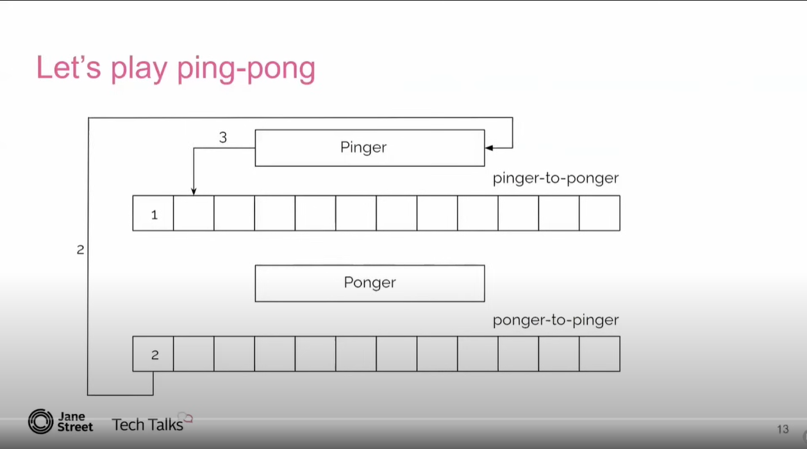

# Ping Pong Bench

Inspired by the talk [System Jitter and Where to Find It: A Whack-a-Mole Experience](https://youtu.be/I_TtMk5z0O0?si=W4UVqLeF-UvSkkM_), this is an exploration into different communication methods to perform ping pong across threads / processes.

## Implementations

- [ ] Golang channels
- [ ] Sockets
- [ ] Pipes
- [ ] Shared Memory
- [ ] RabbitMQ
- [ ] Kafka
- [ ] HTTP?

## Example from the [video](<(https://youtu.be/I_TtMk5z0O0?si=mh297O-lTdVteYp2&t=202)>)

